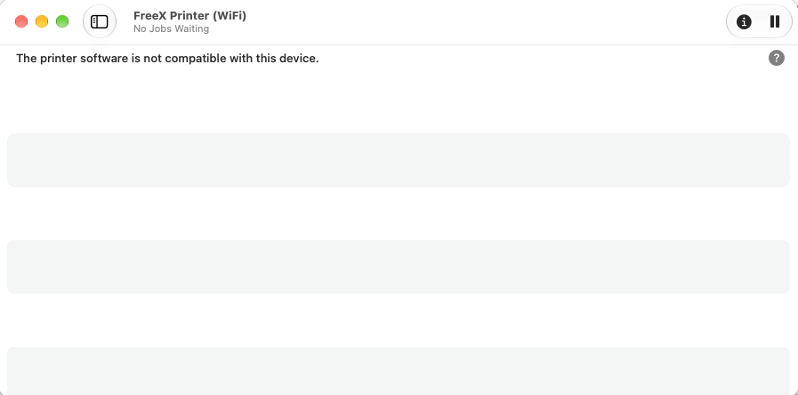
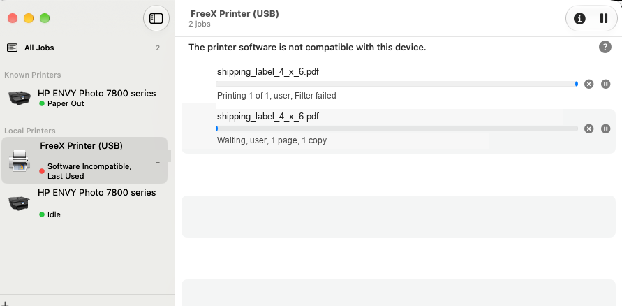
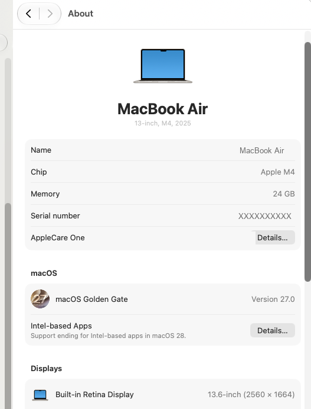
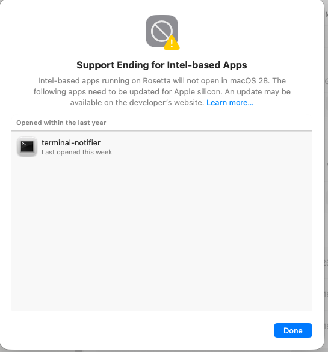
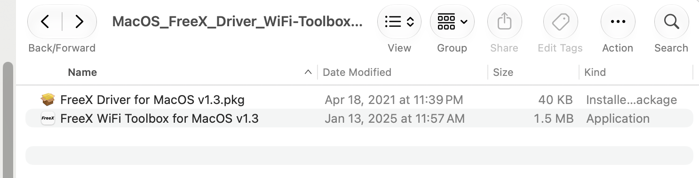
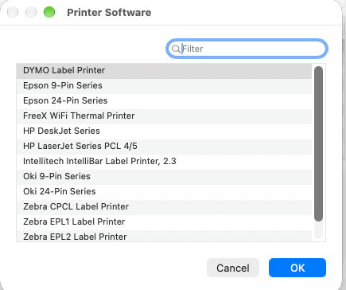
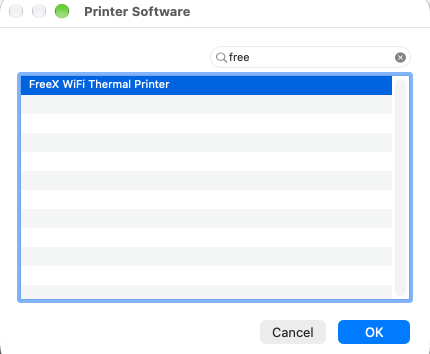
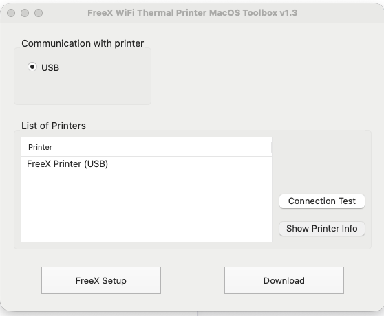
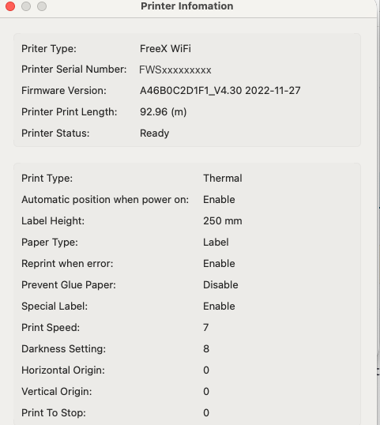

# FreeX Thermal Printer on Apple Silicon Mac — Fix "Filter failed" and "The printer software is not compatible with this device"

**FreeX WiFi Thermal Label Printer not printing on an M1/M2/M3/M4 Mac?** Your FreeX driver is an
Intel-only program, and your Mac can't run it. Install Rosetta 2, then recreate the printer queue:

```bash
softwareupdate --install-rosetta
```

That fixes it in about five minutes. This guide explains how to confirm that's your problem, how to
fix it properly over USB and Wi-Fi, and what to do when Rosetta 2 goes away.

[](#the-rosetta-2-deadline)
[](#does-this-apply-to-me)
[](native-filter/)
[](LICENSE)

> **⏳ Rosetta 2 is going away — and there's a permanent fix here too.**
> macOS 27 is the **last** release with full Rosetta 2. From macOS 28, Intel-only printer drivers
> stop running altogether.
>
> This repository also ships **[a native replacement driver](native-filter/)** — a script with no CPU
> architecture, so it can never hit this problem. It's verified printing real 4x6 shipping labels
> over USB and Wi-Fi. Use Rosetta today; switch to the native filter whenever you like, and
> definitely before macOS 28. See [The Rosetta 2 deadline](#the-rosetta-2-deadline).

**Applies to:** FreeX WiFi Thermal Label Printers and **any** printer whose macOS driver ships an
Intel-only CUPS filter — commonly budget 4x6 thermal shipping-label printers. Worked example uses
FreeX; the diagnosis and fix are vendor-neutral. See [Other printers](docs/other-printers.md).

### FreeX specifics at a glance

| | |
| --- | --- |
| Driver name in macOS | **FreeX WiFi Thermal Printer** (Use → Select Software…) |
| PPD file | `/Library/Printers/PPDs/Contents/Resources/FreeX.ppd.gz` |
| CUPS filter | `/usr/libexec/cups/filter/rastertoFreeX` |
| Broken filter architecture | `Mach-O 64-bit executable x86_64` (Intel-only) |
| Vendor utility | FreeX WiFi Toolbox for macOS |
| Network printing | Raw TCP port **9100**, added as **HP Jetdirect – Socket** |
| 4x6 label page size | `w283h425` = 100 × 150 mm |
| Wi-Fi band | **2.4 GHz only** |
| The fix | `softwareupdate --install-rosetta` |

---

## Table of contents

- [FreeX specifics at a glance](#freex-specifics-at-a-glance)
- [Not technical? Start here](#not-technical-start-here)
- [Does this apply to me?](#does-this-apply-to-me)
- [Symptoms](#symptoms)
- [Two ways to fix it](#two-ways-to-fix-it)
- [Don't trust the "Intel-based Apps" screen](#dont-trust-the-intel-based-apps-screen)
- [Quick fix (5 minutes)](#quick-fix-5-minutes)
- [Why this happens](#why-this-happens)
- [Diagnose it yourself](#diagnose-it-yourself)
- [The full fix](#the-full-fix)
- [Setting up a FreeX printer from scratch](#setting-up-a-freex-printer-from-scratch)
- [Which connection are you using?](#which-connection-are-you-using)
- [USB setup](#usb-setup)
- [Wi-Fi setup](#wi-fi-setup)
- [Add a Wi-Fi printer on macOS](#add-a-wi-fi-printer-on-macos)
- [4x6 label defaults](#4x6-label-defaults)
- [The Rosetta 2 deadline](#the-rosetta-2-deadline)
- [Troubleshooting](#troubleshooting)
- [FAQ](#faq)
- [Technical notes](#technical-notes)
- [How this guide was verified](#how-this-guide-was-verified)
- [Questions and help](#questions-and-help)
- [Disclaimer](#disclaimer)

---

## Not technical? Start here

**You do not need to understand any of this to fix it.** Follow these steps exactly. Total time:
about five minutes. Nothing here can damage your Mac or your printer.

### Step 1 — Open Terminal

Terminal is an app already on your Mac. To open it:

1. Press **Command (⌘) + Space** — a search box appears in the middle of your screen
2. Type **Terminal**
3. Press **Return**

A window with plain text appears. That's Terminal. It looks intimidating; you only need one line.

### Step 2 — Copy and paste one command

Copy this exactly, paste it into the Terminal window, and press **Return**:

```
softwareupdate --install-rosetta
```

**What this does:** downloads a small, official Apple component called Rosetta 2 that lets your Mac
run older software. Your printer driver is older software. That's the whole problem.

**Is it safe?** Yes. It comes from Apple's own servers, using a command Apple provides. It doesn't
change your files, your settings, or any of your apps. It doesn't need a restart. Many Macs already
have it.

### Step 3 — Agree to the licence

Terminal will show a licence agreement and ask you to agree. Type **A** and press **Return**.

Then wait. It takes under a minute. When you see your normal prompt again, it's done.

> **No password is needed** for this command. If Terminal *does* ask for a password, it's your Mac
> login password. You won't see anything as you type — that's normal. Press Return when finished.

### Step 4 — Delete your printer and add it back

This part is important. Your Mac saved a "broken" version of the printer, and it stays broken until
you recreate it.

1. Open **System Settings** (the grey gear icon in your Dock, or ⌘+Space → "System Settings")
2. Click **Printers & Scanners** in the left sidebar
3. Click your FreeX printer in the list
4. Click **Remove Printer…** and confirm
5. Click the **Add Printer, Scanner, or Fax…** button
6. Select your FreeX printer from the list
7. **This step matters:** find the **Use** dropdown near the bottom. Click it and choose
   **Select Software…**, then pick **FreeX WiFi Thermal Printer** from the list, then **OK**
8. Click **Add**

> **Why step 7 matters:** if you skip it, macOS may pick "Generic PostScript Printer", which cannot
> print labels and gives you the same error all over again.

### Step 5 — Print a label

Open a label and print it normally. It should work.

**Still not working?** Go to [Troubleshooting](#troubleshooting), or run the
[diagnostic script](#option-a--run-the-diagnostic-script) which checks everything and tells you
what's wrong in plain English.

### What if I'd rather not use Terminal at all?

There's no way around it for this particular fix — Apple provides no clickable installer for
Rosetta 2. The single command above is the only Terminal step in the entire process; everything else
is normal point-and-click.

---

## Does this apply to me?

Run this. Two commands, no changes to your system:

```bash
uname -m
file /usr/libexec/cups/filter/* 2>/dev/null | grep -i x86_64 | grep -vi arm64
```

If the first prints **`arm64`** and the second prints **any** filter, you have this problem — one of
your printer drivers is Intel-only and needs Rosetta 2.

Prefer a full report? Use the [diagnostic script](#option-a--run-the-diagnostic-script).

---

## Symptoms

You almost certainly have this problem if **all** of these are true:



*This is the error most people see first. "This device" means your **Mac**, not your printer.*



*The same failure with a job in the queue: "Filter failed", and the printer marked **Software
Incompatible** in the sidebar. Both messages have one cause.*

- You are on an **Apple Silicon** Mac (Apple M1, M2, M3, M4 or later) — not Intel.
- The printer itself **works**: it powers on, self-tests, feeds labels, and the vendor's own utility
  app connects to it successfully.
- Printing from **normal macOS apps** (Preview, Chrome, Safari, Word, Photos) fails every time.
- macOS shows one or more of:
  - **"The printer software is not compatible with this device."**
  - **"Filter failed"** in the print queue window
  - The printer **pauses itself** after each job
  - Jobs that vanish, or sit at "Printing" forever, with nothing coming out
- **Reinstalling the driver changes nothing** — you may have done it several times already.

In the system log (see [Diagnose it yourself](#option-c--confirm-it-in-the-cups-log)) the real error
is:

```
Bad CPU type in executable
```

This affects **both USB and Wi-Fi/network printing**, because both go through the same driver
component.

### What it is *not*

This is not a broken download, not a bad USB cable, not a firmware problem, not a macOS bug, and not
a defective printer. Nothing is corrupt. Your Mac simply cannot execute the kind of program the
driver is made of.

---

## Two ways to fix it

| | [Install Rosetta 2](#quick-fix-5-minutes) | [Install the native filter](native-filter/) |
| --- | --- | --- |
| Time | 5 minutes | 10 minutes |
| What it does | lets macOS run FreeX's Intel driver | replaces it with an architecture-free one |
| Uses the vendor's driver | yes | no — installs alongside it, nothing removed |
| Works on macOS 28+ | ❌ no | ✅ yes |
| Maturity | the well-travelled path | newer, verified on USB and Wi-Fi |

Both are reversible and they can coexist. If you just want to print today, start with Rosetta. If you
want this solved permanently, go straight to the native filter.

---

## Quick fix (5 minutes)

**1. Install the current driver software** for your printer, from the **manufacturer's official
download page**. (FreeX users: see [Official FreeX downloads and resources](#official-freex-downloads-and-resources).)

**2. Install Rosetta 2.** Open Terminal and run:

```bash
softwareupdate --install-rosetta
```

Accept the licence when prompted. Small download, under a minute, no restart needed. To skip the
prompt: `softwareupdate --install-rosetta --agree-to-license`

**3. Delete and recreate the printer queue.** System Settings → **Printers & Scanners** → select the
printer → **Remove Printer…**, then add it again. A queue created *before* Rosetta was installed can
stay stuck in a broken or paused state even after the underlying problem is fixed.

**4. Print a test page.** It should now work, over USB and over Wi-Fi.

> **Reinstalling the driver again will not help.** The driver file isn't damaged. It's an Intel
> program, and reinstalling it produces another identical Intel program. Only Rosetta 2 lets your
> Mac run it.

---

## Why this happens

macOS prints through **CUPS**. Every print job travels a chain:

```
App → PDF → CUPS → raster image → VENDOR FILTER → printer language → printer
                                   ↑
                        the driver program that breaks
```

The **vendor filter** is a small program the printer manufacturer supplies to translate a page image
into that printer's own language. It lives in `/usr/libexec/cups/filter/`, and the printer's PPD
file names it. For FreeX:

```bash
gunzip -c /Library/Printers/PPDs/Contents/Resources/FreeX.ppd.gz | grep -i cupsFilter
```

```
*cupsFilter: "application/vnd.cups-raster 0 rastertoFreeX"
```

Now ask what kind of program that filter actually is:

```bash
file /usr/libexec/cups/filter/rastertoFreeX
```

```
/usr/libexec/cups/filter/rastertoFreeX: Mach-O 64-bit executable x86_64
```

**`x86_64` means Intel.** There is no `arm64` slice — it is not a universal binary. An Apple Silicon
Mac cannot run Intel code natively. Without Rosetta 2 the kernel refuses to launch it, and CUPS
records:

```
execv of /usr/libexec/cups/filter/rastertoFreeX failed. err:86, Bad CPU type in executable
STATE: +com.apple.badarch-error
PID 12345 (/usr/libexec/cups/filter/rastertoFreeX) stopped with status 186 (Bad CPU type in executable)
```

macOS then shows you the far less helpful **"Filter failed"** and **"The printer software is not
compatible with this device."**

**Rosetta 2** is Apple's Intel-to-Apple-Silicon translation layer. Install it and CUPS can run the
Intel filter under translation. Nothing else changes.

### Why Rosetta wasn't already installed

Rosetta 2 is **not** preinstalled on Apple Silicon Macs. macOS offers to install it the first time
you open an Intel **app** — a visible prompt you click through.

A printer filter is never opened by you. It's launched by `cupsd`, a background system daemon with
no window to show a prompt in. So the automatic offer never fires. On a Mac that has never run any
Intel software, the driver fails from the moment it's installed, and the only honest explanation is
buried in a log file.

That's why this is so hard to search for: the visible error blames the *printer*, and the real cause
is a missing *system component* nobody told you about.

---

## Diagnose it yourself

### Option A — run the diagnostic script

**Read-only.** It installs nothing, changes no setting, touches no printer, and enables no logging.
It scans **every** CUPS filter on your Mac, so it works for any printer brand.

```bash
curl -fsSL https://raw.githubusercontent.com/giladmoyal-AI/freex-macos-apple-silicon-fix/main/scripts/diagnose_freex_macos.sh -o diagnose_freex_macos.sh
less diagnose_freex_macos.sh     # always read a script before you run it
bash diagnose_freex_macos.sh
```

It reports your macOS version and CPU, whether Rosetta 2 is installed, every vendor print filter and
its **architecture**, your printer queues, and a plain-English verdict with the exact next step.

Add `--log` to include recent CUPS errors, or `--help` for usage.

### Option B — check by hand

```bash
# 1. Which CPU?  arm64 = Apple Silicon, x86_64 = Intel
uname -m

# 2. Are any installed print filters Intel-only?
for f in /usr/libexec/cups/filter/*; do
  file "$f" | grep -qi 'x86_64' && ! file "$f" | grep -qi 'arm64' && file "$f"
done

# 3. Is Rosetta 2 present?
/usr/bin/pgrep -q oahd && echo "Rosetta installed" || echo "Rosetta NOT installed"

# 4. Which filter does your printer's PPD call for?
gunzip -c /Library/Printers/PPDs/Contents/Resources/YOUR_PPD.ppd.gz | grep -iE 'cupsFilter'

# 5. Where is it, and what is it?
find /Library /usr/libexec -type f -name 'rastertoFreeX' 2>/dev/null \
  -exec ls -l {} \; -exec file {} \;
```

`arm64` in step 1 + any output from step 2 + "NOT installed" in step 3 = this is your problem.

### Don't trust the "Intel-based Apps" screen

macOS 27 has a screen at  → **About This Mac** → **Intel-based Apps** → **Details…**:





**This screen cannot tell you whether Rosetta 2 is installed, and it will never list your printer
driver.** It shows Intel *applications* you have launched. CUPS filters are background components,
so they never appear here.

This is a genuine trap. In the session this guide came from, seeing an unrelated Intel app listed
here led to the conclusion "Rosetta is present and working" — which was **wrong**, and cost hours of
unnecessary work reverse-engineering the printer protocol. Rosetta was not installed at all.

Use the real check instead:

```bash
/usr/bin/pgrep -q oahd && echo "Rosetta installed" || echo "Rosetta NOT installed"
```

The screen *is* useful for one thing: it confirms Apple's deadline in writing — *"Intel-based apps
running on Rosetta will not open in macOS 28."*

---

### Option C — confirm it in the CUPS log

The definitive proof:

```bash
sudo cupsctl --debug-logging        # turn on verbose logging
# ...now try to print, and let it fail...
sudo tail -n 100 /var/log/cups/error_log
```

Search that output for `Bad CPU type in executable`. If it's there, stop looking — that's the whole
problem.

Turn logging back off afterwards; it's noisy and writes a lot to disk:

```bash
sudo cupsctl --no-debug-logging
```

---

## The full fix

### 1. Install Rosetta 2

```bash
softwareupdate --install-rosetta
```

Read and accept the licence. No restart required.

Non-interactive: `softwareupdate --install-rosetta --agree-to-license`

### 2. Verify the filter can now execute

Point this at your own printer's filter:

```bash
arch -x86_64 /usr/libexec/cups/filter/rastertoFreeX
```

**Good** — the filter prints its own usage message, meaning it launched:

```
ERROR: rastertoepson job-id user title copies options [file]
```

Every CUPS filter takes `job-id user title copies options [file]`, so a usage complaint is success
here. (`rastertoepson` is a leftover string from the open-source filter FreeX's driver was built
from. It's normal and not a sign you have the wrong driver.)

**Bad** — Rosetta didn't install; run step 1 again and watch for errors:

```
Bad CPU type in executable
```

> This proves the filter can **run**. It doesn't print anything and is not a print test.

### 3. Recreate the printer queue

A queue created while the driver was unusable can stay paused or hold dead jobs.

1. System Settings → **Printers & Scanners**
2. Select the printer → **Remove Printer…**
3. Add it again — [USB](#usb-setup) or [Wi-Fi](#add-a-wi-fi-printer-on-macos)
4. If it shows as paused, open the queue and choose **Resume**

### 4. Print

Print a real label or test page. USB and Wi-Fi should both work now.

---

## Official FreeX downloads and resources

This repository **does not** redistribute FreeX software, drivers, firmware, or binaries — those are
proprietary. Get them from FreeX directly:

| Resource | Link |
| --- | --- |
| FreeX official site | <https://getfreex.com> |
| **macOS driver + WiFi Toolbox** (and FreeX's own macOS setup guide) | <https://getfreex.com/pages/how-to-print-thermal-labels-via-usb-on-macos> |
| Windows driver + setup guide | <https://getfreex.com/pages/how-to-print-thermal-labels-via-usb-on-windows-10> |
| After-sales FAQ — firmware, character library, troubleshooting | <https://getfreex.com/pages/freex-thermal-label-printer-faq-after-sales> |
| FreeX support | `cs@getfreex.com` |

At the time of writing, FreeX hosts the actual download files on Google Drive and Zoho WorkDrive
mirrors linked from those pages. Always start from the FreeX page rather than a saved mirror link, so
you get the current version.

### The macOS package

The package this guide was written against is `MacOS_FreeX_Driver_WiFi-Toolbox_v1.3`, containing:

- **`FreeX Driver for MacOS v1.3.pkg`** — installs the PPD (`FreeX.ppd.gz`) and the CUPS filter
  (`rastertoFreeX`). This is the component that is Intel-only.
- **`FreeX WiFi Toolbox for MacOS v1.3.app`** — configures the printer's wireless and network
  settings. This app is **not** affected by the Rosetta problem, which is why it keeps working while
  printing fails.

### Which models this applies to

FreeX's macOS guide covers the **FreeX WiFi** and **FreeX USB** models. The newer **FreeX WiFiMAX**
is a different product that FreeX documents separately — if you have that model, follow FreeX's own
instructions first, then come back here if you still hit `Filter failed`.

> **Note:** FreeX's own macOS page does not currently mention Apple Silicon, M1/M2/M3/M4, or
> Rosetta 2 — which is a large part of why this problem is so hard to solve from the official
> documentation alone.

### A word on firmware

FreeX publishes firmware and character-library updates on the after-sales FAQ page linked above.
**This guide never requires a firmware update**, and we deliberately don't link firmware files
directly: a flash interrupted by a power loss, or the wrong file for your serial-number range, can
permanently ruin a thermal printer. If you genuinely need firmware, get it from that page, match your
serial range carefully, and follow FreeX's instructions.

Never take FreeX drivers or firmware from third-party "driver download" sites.

---

## Setting up a FreeX printer from scratch

Brand new printer, nothing installed yet? Follow this order and you will never see the errors this
guide is about.

> ### ⚡ Install Rosetta 2 *before* you add the printer
>
> On an Apple Silicon Mac this single step prevents the entire problem. The FreeX driver needs
> Rosetta, and a printer queue created **before** Rosetta is installed stays broken even after you
> install it — you have to delete and recreate it. One command up front saves the whole cycle:
>
> ```bash
> softwareupdate --install-rosetta
> ```

### 1. Load the labels and calibrate

1. Connect power, switch the printer on.
2. Open the cover and drop in the label roll — these printers feed **labels facing up**, off the top
   of the roll.
3. Slide the paper guides so they touch the roll without pinching it.
4. Close the cover until it clicks on **both** sides. A cover latched on only one side causes
   skewed or blank labels.
5. **Calibrate the gap sensor:** with the printer idle, hold the feed button until it advances a
   couple of labels and stops cleanly at a label edge.

If it feeds continuously or stops mid-label, the sensor has not found the gap — reseat the roll and
repeat. **A printer that cannot detect label gaps prints nothing, however perfect your Mac setup
is.** Do this before you touch the Mac.

### 2. Download the FreeX software

Get it from FreeX directly — see
[Official FreeX downloads and resources](#official-freex-downloads-and-resources). Unzip it and you
should see exactly two items:



- **`FreeX Driver for MacOS v1.3.pkg`** — installs the PPD and the CUPS filter. This is the part
  that needs Rosetta.
- **`FreeX WiFi Toolbox for MacOS v1.3.app`** — configures the printer's Wi-Fi and network
  settings. This app is a **universal** binary and runs natively; it is not the part that breaks.

Note the driver's date: **April 2021** — months before Apple Silicon Macs were widely shipping. That
date is the root of everything else in this guide.

### 3. Install Rosetta 2 — Apple Silicon only

```bash
softwareupdate --install-rosetta
```

Type **A** and press Return to accept the licence. Under a minute, no restart. Skip this only if
`uname -m` prints `x86_64` (an Intel Mac).

### 4. Install the driver

Double-click **`FreeX Driver for MacOS v1.3.pkg`** and go through the installer. If macOS asks you
to approve software from an unidentified developer, allow it in **System Settings → Privacy &
Security**.

Don't open the Toolbox or add the printer yet.

### 5. Add the printer over USB first

Even if you intend to print over Wi-Fi, **get USB working first.** It isolates variables: if USB
works and Wi-Fi doesn't, the problem is genuinely networking.

Follow [USB setup](#usb-setup), then print a test label.

### 6. Then set up Wi-Fi, if you want it

Only once USB prints correctly, follow [Wi-Fi setup](#wi-fi-setup) and
[Add a Wi-Fi printer on macOS](#add-a-wi-fi-printer-on-macos).

### 7. Make 4x6 the default

See [4x6 label defaults](#4x6-label-defaults) so you are not changing paper size on every print.

---

## Which connection are you using?

There are three ways to connect a label printer, and it's worth being clear which one you have,
because the setup differs but **the Rosetta fix is identical for all three**.

| Connection | How the printer attaches | macOS setup |
| --- | --- | --- |
| **USB** | Cable straight to the Mac | Add from the **Default** tab — [USB setup](#usb-setup) |
| **Wi-Fi (wireless LAN)** | Printer joins your 2.4 GHz network | Configure via Toolbox, then add by **IP** — [Wi-Fi setup](#wi-fi-setup) |
| **Wired Ethernet (wired LAN)** | RJ45 cable to your router or switch | Add by **IP**, exactly like Wi-Fi — [see below](#wired-ethernet-lan) |

The **FreeX WiFi** model covered by this guide connects over **USB and Wi-Fi**. It has no Ethernet
port, so the wired path doesn't apply to it — but it does apply to plenty of other label printers,
and the macOS steps are the same.

### Wired Ethernet (LAN)

If your printer has an RJ45 port, plug it into your router or switch and it will normally pick up an
IP address by DHCP. From there, **macOS treats wired and wireless network printers identically** —
both are raw TCP printing on port 9100:

1. Find the printer's IP (print a self-test/configuration label, or check your router's client list)
2. Confirm your Mac can reach it: `nc -vz 192.168.1.100 9100`
3. Add it via **Add Printer → IP** with Protocol **HP Jetdirect – Socket** —
   [full steps](#add-a-wi-fi-printer-on-macos)

Everything in [Add a Wi-Fi printer on macOS](#add-a-wi-fi-printer-on-macos), the port 9100 tests, and
the DHCP-reservation advice applies unchanged to a wired connection. The only part that's
Wi-Fi-specific is configuring the wireless credentials in the Toolbox.

> **"Wi-Fi" and "LAN" both mean network printing here.** Wi-Fi is a wireless LAN; Ethernet is a wired
> LAN. Once the printer has an IP address, macOS doesn't care how it got there.

### Which should you actually use?

**If the printer sits next to the Mac and you print labels for a living, use USB.**

Both work, and print identically — the same filter produces the same bytes either way. But they fail
differently, and USB has far less that can go wrong:

| | USB | Wi-Fi |
| --- | --- | --- |
| Depends on an IP address | no | **yes** |
| Breaks when the DHCP lease changes | no | **yes**, unless reserved |
| Breaks if another device serves DHCP | no | **yes** — see [rogue DHCP](docs/troubleshooting.md#the-printer-got-an-address-on-a-completely-different-network) |
| Breaks if Wi-Fi drops or the router reboots | no | **yes** |
| Printer can sit anywhere | no | **yes** |

Every network failure documented in this guide — a lease moving, a second DHCP server handing out
addresses, a queue pointing at an address nothing answers on — applies **only to Wi-Fi**. A USB queue
has no address to be wrong about.

Wi-Fi is worth it when the printer needs to live away from the Mac, or be shared. If you use it,
[reserve the address on your router](docs/wifi-setup.md#stop-the-ip-address-from-changing) — that
removes the most common failure.

**Best of both:** set up *both* queues. They cost nothing, they use the same driver, and if one path
breaks mid-shipping you switch printers in the print dialog instead of troubleshooting.

---

## USB setup

1. Connect the printer by USB and power it on.
2. System Settings → **Printers & Scanners** → **Add Printer, Scanner, or Fax…**
3. On the **Default** tab, select your printer.
4. In the **Use** dropdown choose **Select Software…**
5. Pick your printer's driver — for FreeX, **FreeX WiFi Thermal Printer**.
6. Click **Add**.



*The installed driver list. **FreeX WiFi Thermal Printer** sits between Epson and HP. If it isn't
listed at all, the driver package didn't install — run the `.pkg` again before going further.*

> **These two screenshots were taken with only FreeX's own driver installed.** If you have also
> installed the [native filter](native-filter/), you will see a **second** entry,
> **FreeX WiFi Thermal Printer (Native)**. The two look almost identical, so check for the
> `(Native)` suffix and pick deliberately:
>
> | Entry | Which driver | Needs Rosetta |
> | --- | --- | --- |
> | `FreeX WiFi Thermal Printer` | FreeX's own, Intel-only | yes — and stops working at macOS 28 |
> | `FreeX WiFi Thermal Printer (Native)` | this project's script | no |



*Faster: type `FreeX` in the filter box, select it, click **OK**. This is the step people skip — and
skipping it is what leaves macOS on a generic driver. With the native filter installed, this same
list shows two FreeX entries — see the note above.*

**Do not accept a generic driver.** If macOS auto-fills *Generic PostScript Printer* or *Generic PCL
Printer*, change it. A thermal label printer understands neither PostScript nor PCL, and a generic
driver produces "Filter failed" or pages of garbage.

Created this queue before installing Rosetta? Remove and re-add it —
see [step 3 above](#3-recreate-the-printer-queue).

---

## Wi-Fi setup

Full walkthrough: **[docs/wifi-setup.md](docs/wifi-setup.md)**. Summary for FreeX:

Connect by **USB first** — the Toolbox configures Wi-Fi *through* the USB connection.



*The Toolbox connects over USB. **This working does not mean printing will work** — the Toolbox
never uses the CUPS driver that fails.*



*"Show Printer Info" reading the hardware successfully. Useful confirmation that the printer and
cable are fine — and a reminder that this proves nothing about macOS printing. The Toolbox behaves
the same whichever driver you use; it never touches the CUPS filter.*

**FreeX Setup → WiFi**

| Field | Value |
| --- | --- |
| Mode | `STA` |
| Authentication | `WPA-PSK/WPA2-PSK` |
| Type | `WPA2-PSK` |
| Encryption | `AES` |
| SSID | `YOUR_WIFI_NAME` (2.4 GHz) |
| Password | your Wi-Fi password |

**FreeX Setup → Ethernet**

| Field | Value |
| --- | --- |
| DHCP | `Enable` |
| Port | `9100` |

Apply, then **restart the printer**:


It prints a small configuration label showing its IP address, the network it joined, and port
`9100`.

> **These printers are 2.4 GHz only.** If your router broadcasts one merged name for 2.4 GHz and
> 5 GHz, that is the most common reason setup fails.

**Don't know your printer's IP?** The easiest way: switch the printer off, wait 5 seconds, switch it
on, and wait a minute — it prints a small label showing its IP, network name and port. Full details
and two other methods: [How to find your printer's IP address](docs/wifi-setup.md#how-to-find-your-printers-ip-address).

Confirm the Mac can reach it (use your printer's real IP):

```bash
nc -vz 192.168.1.100 9100
```

```
Connection to 192.168.1.100 port 9100 [tcp/hp-pdl-datastr] succeeded!
```

---

## Add a Wi-Fi printer on macOS

1. System Settings → **Printers & Scanners** → **Add Printer, Scanner, or Fax…**
2. Choose the **IP** tab.

| Field | Value |
| --- | --- |
| Address | your printer's IP, e.g. `192.168.1.100` |
| Protocol | **HP Jetdirect – Socket** |
| Queue | *leave blank* |
| Name | anything, e.g. `Label Printer (WiFi)` |
| Use | **Select Software…** → your printer's driver |

3. Click **Add**.


*Queue stays blank. **Use** must be a FreeX driver, not a generic one. This screenshot shows the
vendor driver; if you're using the [native filter](native-filter/), choose
**FreeX WiFi Thermal Printer (Native)** here instead — everything else is identical.*

**"HP Jetdirect – Socket" is correct**, and has nothing to do with HP. It's simply macOS's name for
raw TCP printing on port 9100, which is what these printers speak. Don't use IPP, LPD, or AirPrint.

This works **only after Rosetta 2 is installed** — network queues use the same Intel filter as USB
queues.

---

## 4x6 label defaults

Tired of changing Paper Size on every print? Set it once.

### Which 4x6 do you want?

The FreeX driver offers **two** sizes that both look like "4x6" — they are not the same:

| Option | Actual size | Use when |
| --- | --- | --- |
| `w288h432` | exactly **4.00 x 6.00 inches** | US shipping labels (USPS, UPS, FedEx, Amazon) |
| `w283h425` | **100 x 150 mm** = 3.94 x 5.91 in | labels sold in metric sizes |

The driver ships with **`w283h425`** as its default, so if you buy US 4x6 labels you are
printing about 1.5% small unless you change it. Usually harmless, but it can shift a barcode
near the edge.

### Method 1 — set the queue default (recommended)

This applies in every app, so you never touch Paper Size again.

**Step 1: get the queue's internal name.** This is *not* the name you see in System Settings:

```bash
lpstat -p
```

You'll see something like `FreeX_Native_WiFi` — underscores, no spaces or brackets. **That exact
string is what you type in the commands below**, in place of `<QUEUE>`.

> ⚠️ **Two things trip people up here.**
>
> `<QUEUE>` is a placeholder — substitute your own name from `lpstat -p`. Pasting it literally gives
> you `Unable to get PPD file for <QUEUE>`.
>
> And the **display name does not work**. `lpoptions -p "FreeX Printer (WiFi)"` fails the same way.
> Only the underscored internal name works.

Prefer not to copy by hand? This prints ready-to-run commands with your own queue names filled in:

```bash
for q in $(lpstat -v | sed -n 's/^device for \([^:]*\):.*/\1/p'); do
  echo "lpoptions -p $q -l | grep -i PageSize"
done
```

**Step 2: see the available sizes** (the `*` marks the current default):

```bash
lpoptions -p <QUEUE> -l | grep -i PageSize
```

**Step 3: set it.**

```bash
lpoptions -p <QUEUE> -o PageSize=w288h432      # true 4x6 inches
# or
lpoptions -p <QUEUE> -o PageSize=w283h425      # 100 x 150 mm
```

**Step 4: confirm.**

```bash
lpoptions -p <QUEUE> -l | grep -i PageSize      # the * marks the active size
```

To apply it for **every user** on the Mac rather than just you:

```bash
sudo lpadmin -p <QUEUE> -o PageSize=w288h432
```

Quit and reopen the app afterwards — print dialogs cache the old size.

### Method 2 — save a print preset

Some apps (Preview especially) override the queue default with US Letter anyway. A preset wins:

1. Open a label, press **Cmd+P**
2. **Printer** -> your FreeX queue
3. **Paper Size** -> the 4x6 / 100x150 mm entry
4. **Scale** -> 100%, or **Scale to Fit -> Print Entire Image**
5. **Presets** -> **Save Current Settings as Preset...**
6. Name it `FreeX 4x6`
7. Choose **Only this printer** if offered, so it doesn't hijack your other printers

Select `FreeX 4x6` from **Presets** whenever you print labels.

> ⚠️ **Then uncheck one box, or the preset won't stick.** In
> **Presets → Edit Preset List** there is an option called **"Reset Presets Menu to
> 'Default Settings' After Printing"**. While it is ticked, macOS drops your preset after *every*
> print and reverts to defaults — so the next label comes out wrong again. Uncheck it and macOS
> remembers your preset per printer. See
> [the full explanation](docs/troubleshooting.md#the-setting-that-silently-undoes-your-preset).

### Don't change the system-wide default

System Settings has a global **Default paper size**. Leave it on Letter. Changing it makes every
printer default to 4x6, which is rarely what you want. Set it per queue instead.

### Still wrong?

- The label file itself may not be 4x6 — a Letter-size PDF with a label in the corner prints exactly
  that way
- **Scale to Fit** should be **Print Entire Image**, not *Fill Entire Paper*
- Check the physical roll matches, and that the **gap sensor is calibrated**

---

## The Rosetta 2 deadline

Rosetta 2 fixes this today, but it is being retired.

- **macOS 27 is the last release with full Rosetta 2.**
- From **macOS 28**, Apple narrows Rosetta to legacy gaming frameworks only. General-purpose Intel
  binaries — including **printer drivers and vendor utilities** — will no longer run.
- macOS 26.4+ already shows a warning when you launch an Intel-only app.

**What that means for you**

| Situation | What to do |
| --- | --- |
| On macOS 27 or earlier, need it working now | Install Rosetta 2. This guide works. |
| Planning ahead | Ask your printer vendor for a **native Apple Silicon (arm64) driver**. It's a reasonable request and vendor pressure is what gets them built. |
| Vendor is unresponsive or gone | **Use the [native filter](native-filter/) in this repository** — a script-based replacement with no CPU architecture, so Rosetta is irrelevant. Verified on USB and Wi-Fi. |
| Buying a new label printer | Check for a **native Apple Silicon driver**, or **AirPrint / IPP Everywhere** support, which needs no vendor driver at all. |

Before upgrading to macOS 28, re-run the diagnostic script. If it still reports an Intel-only filter,
your printer will stop working on that upgrade.

### A fix that outlives Rosetta

This repository includes **[a native replacement filter](native-filter/)** for FreeX printers.

It does the same job as FreeX's `rastertoFreeX` — converts a rasterised page into the printer's TSPL
commands — but it is written as a **script**. A script has no CPU architecture, so it cannot fail
with `Bad CPU type in executable`, on any Mac, ever. No Rosetta required.

It has been verified printing real 4x6 USPS shipping labels over both USB and Wi-Fi, with scannable
barcodes. It installs alongside FreeX's driver without touching it, so you can switch back at any
time.

```bash
cd native-filter && sudo bash install.sh
```

See [native-filter/README.md](native-filter/README.md) for details, options and caveats.

---

## Troubleshooting

Full detail in **[docs/troubleshooting.md](docs/troubleshooting.md)**. For streaks, smearing, faded
labels and print-head cleaning, see **[docs/print-quality.md](docs/print-quality.md)**.

| Symptom | Cause | Fix |
| --- | --- | --- |
| Vendor app sees the printer, macOS printing fails | Vendor app bypasses CUPS; the CUPS filter is Intel-only | `softwareupdate --install-rosetta` |
| `Bad CPU type in executable` in the CUPS log | Rosetta 2 missing | Install Rosetta, verify with `arch -x86_64 …` |
| "Filter failed" on every job | Same cause — or a generic driver got selected | Install Rosetta; confirm the queue uses the real vendor driver |
| Printer pauses itself after each job | Filter failing | Install Rosetta, then Resume the queue |
| `nc -vz IP 9100` succeeds but nothing prints | Network is fine; the filter is failing | It's the Rosetta problem, not a network problem |
| Reinstalled the driver repeatedly, no change | Reinstalling an Intel binary yields an Intel binary | Install Rosetta |
| USB queue still errors after installing Rosetta | Stale queue created pre-Rosetta | Remove the printer, add it again |
| Printer's IP is on a **different subnet** than your Mac | Something other than your router is handing out addresses — often macOS **Internet Sharing** | [Find the rogue DHCP server](docs/troubleshooting.md#the-printer-got-an-address-on-a-completely-different-network) — a router reservation cannot fix this |
| Worked yesterday, dead today (Wi-Fi) | DHCP gave the printer a new IP | [Reserve the printer's IP on your router](docs/wifi-setup.md#stop-the-ip-address-from-changing) — the most common delayed failure |
| Labels tiny, shifted, or on a huge blank page | App defaulted to Letter | Use a saved 4x6 preset |
| Streaks, smearing, faded or blurry labels | Dirty print head or platen roller | [Clean the printer](docs/print-quality.md) — usually five minutes with a cotton swab |
| Size or borders differ on **every** print | "Scale to Fit" is recalculating, or queue and app disagree on paper size | [Match the sizes and set Scale to 100%](docs/troubleshooting.md#labels-print-at-a-different-size-or-with-different-borders-every-time) |

---

## FAQ

### Why won't my FreeX printer print from my Mac?

Because the FreeX driver is Intel-only software and your Mac has an Apple Silicon chip (M1, M2, M3,
M4). It physically cannot run that software until you install Rosetta 2, Apple's compatibility layer.
Run `softwareupdate --install-rosetta`, then delete and re-add the printer. The printer itself is
fine.

### Why does my label printer work on Windows but not on my Mac?

The Windows driver and the Mac driver are completely separate programs. The Windows one was built for
your PC's processor and works. The Mac one was built for Intel Macs and was never rebuilt for Apple
Silicon, so your Mac can't run it without Rosetta 2. It's not that the printer prefers Windows.

### What is Rosetta 2, in plain English?

A translator built by Apple. Older Mac software was written for Intel chips; new Macs use Apple's own
chips, which speak a different language. Rosetta 2 translates on the fly so old software still runs.
It's free, official, small, and installed with one command.

### Can this damage my Mac or my printer?

No. Installing Rosetta 2 adds an Apple component; it doesn't modify your files, apps, or settings,
and needs no restart. Removing and re-adding a printer only affects that printer's entry on your Mac.
The diagnostic script in this repo is read-only and changes nothing. Nothing in this guide touches
printer firmware — the one genuinely risky thing with thermal printers, which is why we don't go near
it.

### How do I open Terminal on a Mac?

Press **Command (⌘) + Space**, type **Terminal**, press **Return**. See
[Not technical? Start here](#not-technical-start-here) for the full walkthrough.

### Do I need an administrator password?

Usually not — `softwareupdate --install-rosetta` normally runs without one. If you're asked, it's
your Mac login password. Nothing is displayed as you type it; that's normal, just press Return.

### How long does this take?

About five minutes total. The Rosetta download is under a minute on a normal connection; re-adding
the printer takes two or three.

### It said Rosetta is already installed, or finished instantly. Now what?

Then Rosetta wasn't your problem, or it was already fixed. Go straight to
[deleting and re-adding the printer](#step-4--delete-your-printer-and-add-it-back) — a queue created while
the driver was broken stays broken. If it still fails, run the
[diagnostic script](#option-a--run-the-diagnostic-script).

### Do I need to uninstall or reinstall the FreeX driver first?

No. That's the most common wasted step. The driver you already have is fine — your Mac just couldn't
run it. Install Rosetta 2 and the existing driver starts working.

### Do I have to do this for every printer?

Rosetta 2 is installed once per Mac and covers every Intel program. But each *printer queue* created
while things were broken should be deleted and re-added.

### What is a CUPS filter?

CUPS is the printing system built into macOS. A "filter" is a small program from the printer
manufacturer that converts your document into the specific commands your printer understands. FreeX's
filter is called `rastertoFreeX`. It's this program — not the printer — that fails to run.

### My printer prints a test page from the FreeX Toolbox but not from Preview or Chrome

Classic symptom, and it confirms the diagnosis. The Toolbox talks to the printer directly and never
uses the macOS driver. Preview and Chrome go through macOS, which needs the driver. So the Toolbox
succeeds while everything else fails. Your hardware is fine; install Rosetta 2.

### Does this work on macOS Sonoma, Sequoia, Tahoe, 26, or 27?

Yes, on every macOS version through 27. From macOS 28 onward Rosetta 2 no longer covers printer
drivers, and this fix stops working — see [The Rosetta 2 deadline](#the-rosetta-2-deadline).

### What does "Filter failed" mean on macOS?

CUPS successfully prepared your document but could not run the printer manufacturer's conversion
program (the "filter"). On Apple Silicon Macs the usual reason is that the filter is an Intel-only
binary and Rosetta 2 isn't installed. It is a **software** failure on your Mac, not a printer,
cable, or network failure.

### What does "The printer software is not compatible with this device" mean?

Despite how it reads, "this device" means **your Mac**, not your printer. macOS is saying the driver
software can't run on this computer's processor. The driver is Intel-only; your Mac is Apple
Silicon. Install Rosetta 2 and it becomes compatible.

### How do I know if my Mac is Apple Silicon or Intel?

```bash
uname -m
```

`arm64` = Apple Silicon (M1/M2/M3/M4…). `x86_64` = Intel. Or check  → About This Mac; Apple
Silicon Macs list a "Chip" like Apple M4, Intel Macs list a "Processor".

### How do I check whether a printer driver is Intel-only?

```bash
file /usr/libexec/cups/filter/*
```

Any filter that says `x86_64` **without** also saying `arm64` is Intel-only and needs Rosetta 2. A
line reading "universal binary" with both architectures is fine.

### Is Rosetta 2 safe to install?

Yes. It's an official Apple component, installed with Apple's own `softwareupdate` command from
Apple's servers. It doesn't modify your existing apps, needs no restart, and can be installed on any
Apple Silicon Mac. Many people already have it without knowing.

### Will reinstalling the printer driver fix "Filter failed"?

No. The downloaded driver isn't corrupt — it's Intel software, and reinstalling it just puts the
same Intel software back. This is the single biggest time-waster with this problem. Install
Rosetta 2 instead.

### Does this affect USB printing, Wi-Fi printing, or both?

Both. USB and network printing use different *transports* but the same *driver filter*, and the
filter is what's failing. A printer that works over USB in the vendor's utility but fails from
Preview over both USB and Wi-Fi is the classic signature.

### Why does the manufacturer's own app connect fine while macOS can't print?

The vendor's utility talks to the printer directly, over USB or the network. It never goes through
CUPS and never runs the CUPS filter. So it connects, tests, and configures perfectly while every
normal print job fails. A successful connection test only proves your hardware and cabling are
fine — which is useful, because it rules them out.

### Does Rosetta 2 slow down printing?

Not noticeably. The translated code only converts a page image into printer commands — a tiny amount
of work next to the printing itself. Rosetta also caches translations after first run.

### Do I need to reinstall Rosetta after a macOS update?

Usually no; it persists across updates. If a major upgrade seems to have removed it, re-running
`softwareupdate --install-rosetta` is harmless and takes seconds.

### Is Rosetta 2 going away?

Yes. macOS 27 is the last version with full Rosetta 2 support. From macOS 28 it's limited to legacy
game frameworks, so Intel-only printer drivers will stop working entirely. See
[The Rosetta 2 deadline](#the-rosetta-2-deadline).

### My printer isn't a FreeX. Does this still apply?

Yes, if its driver ships an Intel-only CUPS filter — common for budget thermal label printers whose
Mac drivers haven't been rebuilt since 2020. The diagnosis and fix are identical; only the filter
name differs. See [docs/other-printers.md](docs/other-printers.md).

### Can I print without the vendor driver at all?

Sometimes. Many of these printers accept raw commands on TCP port 9100 (often TSPL or ESC/POS), and
some work with a generic driver for that language. It's fiddly and worth it only if no native driver
exists. See [docs/technical-notes.md](docs/technical-notes.md) — clearly marked experimental.

### Where is the CUPS error log on macOS?

`/var/log/cups/error_log`. Read it with `sudo tail -n 100 /var/log/cups/error_log`. For more detail,
enable debug logging first with `sudo cupsctl --debug-logging`, reproduce the failure, then turn it
off with `sudo cupsctl --no-debug-logging`.

---

## Technical notes

**[docs/technical-notes.md](docs/technical-notes.md)** covers how the PPD, the CUPS filter, and the
print chain fit together; how the architecture mismatch was traced through `cupsctl --debug-logging`;
what `strings` on the FreeX filter reveals about its TSC/TSPL command set (`SIZE`, `GAP`, `DENSITY`,
`BITMAP`, `PRINT`); and generalisable lessons for debugging any Intel-only vendor component on
Apple Silicon.

It also documents an **experimental** direct-to-port-9100 approach explored before the real cause was
found. **That is not a recommended solution** — once Rosetta 2 is installed the official driver works
normally and there's no reason to bypass it.

---

## Questions and help

**[Ask a question in Discussions →](https://github.com/giladmoyal-ai/freex-macos-apple-silicon-fix/discussions/categories/q-a)**

If this guide didn't solve it, or your printer behaves differently, ask there rather than guessing.
Questions get marked with an accepted answer, so the next person with the same problem finds it
straight away.

Useful to include:

- Your printer make and model
- `sw_vers` and `uname -m` output
- The output of `file /usr/libexec/cups/filter/*` (or the diagnostic script)
- What you've already tried

**[Did this fix your printer? Let us know →](https://github.com/giladmoyal-ai/freex-macos-apple-silicon-fix/discussions)**
Reports from **non-FreeX printers are especially welcome** — they help confirm how widely this
applies.

> **Please don't post private information.** No Wi-Fi names or passwords, no local IP addresses, no
> printer serial numbers, no shipping labels, no customer or order data. Use placeholders like
> `YOUR_WIFI_NAME` and `192.168.1.100`, and redact screenshots before uploading them.

---

## Contributing

If this fixed your printer — or if your model, brand, or macOS version needs a different step —
please open an issue or pull request. Reports from **non-FreeX printers are especially welcome**, so
this can list more confirmed cases.

**Do not include private information in issues.** No Wi-Fi network names or passwords, no local IP
addresses, no printer serial numbers, no shipping labels, no customer names or addresses, no order or
tracking numbers. Use placeholders like `YOUR_WIFI_NAME`, `192.168.1.100`, and `YOUR_MAC_USERNAME`,
and redact log excerpts before posting.

---

## How this guide was verified

This guide comes from fixing a real FreeX WiFi Thermal Label Printer on a MacBook Air (Apple M4,
macOS 27.0) that was failing with both error messages. Being explicit about what that does and
doesn't establish:

**Verified directly on the affected Mac** — these are quoted from real output, not reconstructed:

- `rastertoFreeX` reports as `Mach-O 64-bit executable x86_64` (Intel-only, no arm64 slice)
- The PPD's filter line is exactly `*cupsFilter: "application/vnd.cups-raster 0 rastertoFreeX"`
- `/var/log/cups/error_log` contained `err:86, Bad CPU type in executable`,
  `STATE: +com.apple.badarch-error`, and `stopped with status 186`
- After installing Rosetta 2, `arch -x86_64 /usr/libexec/cups/filter/rastertoFreeX` returns
  `ERROR: rastertoepson job-id user title copies options [file]`
- `w283h425` is the PPD's `*DefaultPageSize` and is defined as `100mmx150mm`
- The driver's display name is exactly `FreeX WiFi Thermal Printer`
- The TSPL command strings quoted in [technical notes](docs/technical-notes.md) are from the binary
- The last `badarch` error was logged roughly 50 minutes **before** the USB and network queues were
  recreated; both have been idle, enabled, and error-free since

**Observed once, on one printer and one network** — correct for that setup, but not independently
confirmed across models or firmware versions:

- The specific FreeX WiFi Toolbox field values (Mode `STA`, `WPA-PSK/WPA2-PSK`, `WPA2-PSK`, `AES`,
  DHCP `Enable`, Port `9100`)
- That the printer prints a configuration label showing its IP, network, and port after a restart
- The exact wording and layout of Toolbox screens, which vary between versions

If something differs on your setup, that's useful — please
[open an issue](https://github.com/giladmoyal-ai/freex-macos-apple-silicon-fix/issues) so this can be
corrected.

---

## Disclaimer

- This is an **independent community troubleshooting guide**. It is **not affiliated with, endorsed
  by, or supported by** FreeX, Apple, or any printer manufacturer.
- FreeX and all other trademarks belong to their respective owners, and are used here only to
  identify the hardware and software this guide applies to.
- **No proprietary drivers, firmware, or binaries are distributed here.** Obtain those only from
  official sources.
- **Firmware updates can permanently brick a thermal printer** if the wrong file is used or power is
  interrupted. Nothing in this guide requires a firmware update. Don't flash firmware from unofficial
  sources.
- Provided as-is, without warranty. You are responsible for changes you make to your own system.
  See [LICENSE](LICENSE).

---

<sub>Keywords: FreeX printer not working on Mac · FreeX WiFi Thermal Label Printer macOS driver ·
FreeX thermal printer Apple Silicon · FreeX M1 M2 M3 M4 · rastertoFreeX · FreeX WiFi Toolbox ·
FreeX 4x6 shipping labels · macOS "Filter failed" fix · "The printer software is not compatible with
this device" · Bad CPU type in executable · Rosetta 2 printer driver · CUPS filter x86_64 · thermal
label printer macOS · TSPL port 9100</sub>
