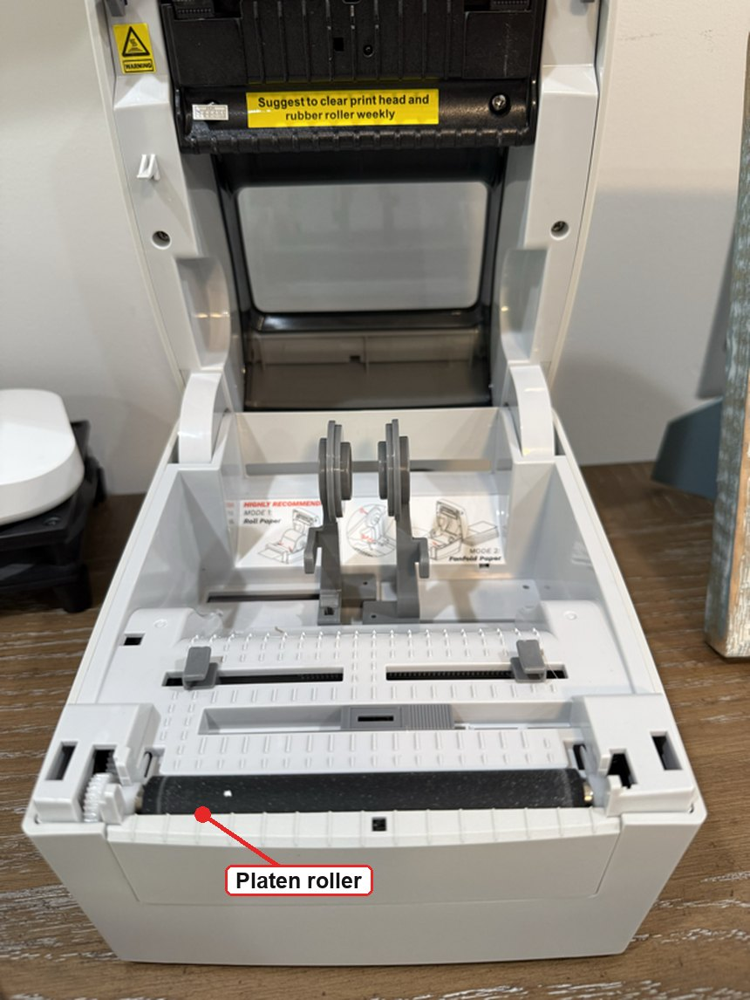
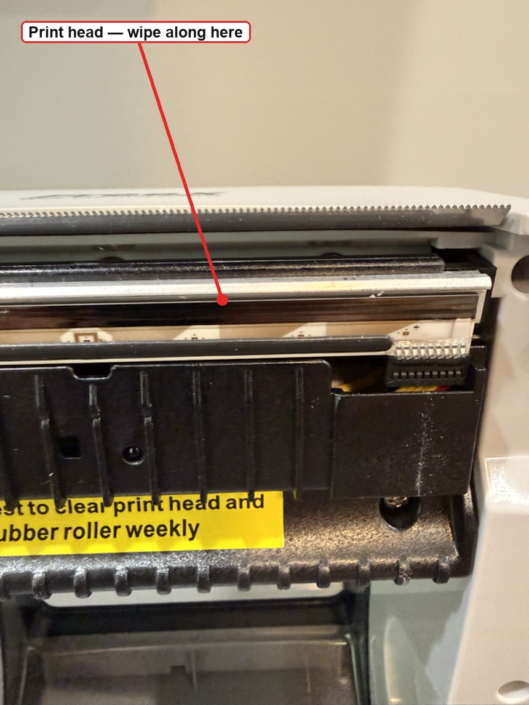
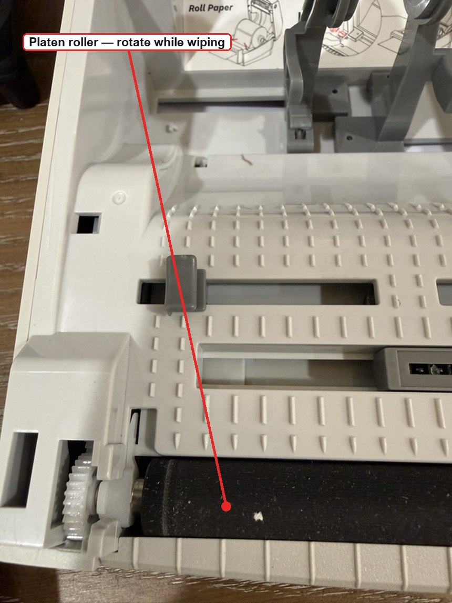

# Print Quality: Streaks, Smearing, Faded Labels and How to Clean the Printer

Labels coming out streaky, blurry, faded, or with white lines through the
barcode? That is almost always **hardware**, not the driver — and usually fixed
in five minutes with a cotton swab.

> If nothing prints at all, or you get "Filter failed", that's a different
> problem — see the [main guide](../README.md).

---

## Match the symptom

| What you see | Most likely cause | Go to |
| --- | --- | --- |
| **Vertical white line** running down every label, same place | Dirt on the print head, or a burnt-out dot | [Clean the head](#how-to-clean-the-print-head) |
| **Smudged or smeared** print, blurry edges | Adhesive residue on head or roller | [Clean the head](#how-to-clean-the-print-head) + [roller](#clean-the-platen-roller) |
| **Faded or grey**, barcode won't scan | Darkness too low, speed too high, or worn head | [Darkness and speed](#darkness-and-speed) |
| **Too dark**, letters filled in, bleeding | Darkness too high | [Darkness and speed](#darkness-and-speed) |
| **Blank labels** feeding through | Label roll in upside down | [Media](#media-the-boring-cause-of-most-problems) |
| **Patchy, uneven** darkness across the label | Dirty or worn roller, or head not latched evenly | [Clean the roller](#clean-the-platen-roller) |
| Print **drifts down the label** or crosses the gap | Gap sensor not calibrated | [Calibration](#recalibrate-the-gap-sensor) |
| Quality dropped **suddenly after a new roll** | Different media, or debris from the new roll | [Media](#media-the-boring-cause-of-most-problems) |

---

## Know what you're looking at

Open the cover and you'll see the two parts that matter. Everything on this page
is about keeping these two clean:



- The **platen roller** is the black rubber cylinder in the base — easy to spot,
  marked above. It presses the label against the head and pulls it through.
- The **print head** is on the **underside of the lid**, facing down. You cannot
  see it from this angle, which is why it is not marked here — tilt the lid up
  and look underneath, or see the close-up in the next section.

FreeX puts a sticker right on the print head assembly saying *"Suggest to clear
print head and rubber roller weekly."* They are not being cautious — these are
the two wear parts, and the ones that make print quality fall off.

---

## How to clean the print head

The single highest-value maintenance task. Do it every roll or two, or any time
quality drops.

### You need

- **99% isopropyl alcohol** (not 70% — the water content leaves residue)
- A **lint-free** swab, cotton bud or microfibre cloth
- Nothing else. No water, no household cleaner, no ammonia

### Steps

1. **Power the printer off and unplug it.** Not just idle — off.
2. **Let it cool for a few minutes.** The head runs hot and is easier to damage
   warm.
3. Open the cover and **remove the label roll**.
4. Find the **print head**: a thin dark strip running the full width of the
   paper path, usually on the underside of the lid where the label passes.
5. Dampen the swab with alcohol — **damp, not dripping**.
6. Wipe **gently along the strip**, end to end, in one direction. Repeat with a
   clean swab until nothing more comes off.



> **Wipe the silver strip, not the serrated bar above it.** That saw-toothed edge
> is the tear-off blade — it needs no cleaning. The print head is the smooth
> metallic line just below it, where the label actually passes.
7. **Let it dry completely** — at least a minute. Closing it wet can damage the
   head.
8. Reload the roll, close the cover firmly on **both** sides, power on.

### Never

- **Never** use a knife, fingernail, or anything metal to scrape it. The heating
  elements are microscopically thin and a single scratch causes a permanent white
  line.
- **Never** use water or household cleaners.
- **Never** touch the head with bare fingers — skin oils and static both harm it.

---

## Clean the platen roller

The rubber roller beneath the label. Adhesive builds up here and causes
smearing, patchiness and slipping.

1. Printer **off and unplugged**, cover open, roll removed
2. Dampen a lint-free cloth with isopropyl alcohol
3. Wipe the roller while **rotating it slowly with your finger**, so you clean
   the whole circumference — not just the strip facing you
4. Let it dry fully before reloading



Only about a third of the roller faces you at a time. If you wipe without turning
it, you leave two thirds dirty — and the smearing comes straight back on the next
label.

If the roller is visibly shiny, grooved, or has flat spots, it is worn and needs
replacing — cleaning will not bring it back.

---

## Clean the gap sensor

A small sensor in the paper path that finds the gaps between labels. Dust or
adhesive on it causes mis-positioned print or endless label feeding.

Blow it out with a puff of air, or wipe very gently with a dry lint-free swab.
Then [recalibrate](#recalibrate-the-gap-sensor).

---

## Darkness and speed

If the head and roller are clean and print is still too light or too dark, the
settings are wrong — not the hardware.

**The rule:** slower printing and higher darkness give crisper output. Faster
printing needs more darkness to keep up, and eventually blurs regardless.

For barcodes, prefer **slower and darker**. A barcode that won't scan costs far
more than a few seconds per label.

Using this project's [native filter](../native-filter/):

```bash
lpoptions -p <QUEUE> -o freex-density=10      # 0-15, default 8. Higher = darker
```

Using the vendor driver, set **Darkness** and **Print Speed** in the print
dialog's printer options, or in the FreeX Toolbox.

If text is too light but solid blocks look fine, try raising the black/white
cutoff instead — it makes thin strokes render more solidly:

```bash
lpoptions -p <QUEUE> -o freex-threshold=150   # default 128, higher = more black
```

---

## Media: the boring cause of most problems

Thermal printers have no ink. The paper itself darkens under heat, so **the
labels are half the print system**.

- **Direct thermal only.** These printers cannot use thermal-transfer labels
  (the kind needing a ribbon). Transfer labels come out blank.
- **Right side up.** Direct thermal labels are coated on one side only. If they
  feed through blank, the roll is in upside down — flip it.
- **Cheap labels print worse.** Thin or poorly coated stock gives grey, patchy
  output no amount of darkness fixes, and leaves more residue on the head, which
  then smears the *next* roll too.
- **Scratch test:** drag a fingernail firmly across a blank label. The coated
  side leaves a dark line from friction heat. That side faces the print head.
- **Heat and sunlight fade labels.** Store rolls somewhere cool and dark; don't
  leave printed labels on a sunny windowsill.

---

## Recalibrate the gap sensor

After cleaning, changing label size, or if print creeps down the label:

With the printer idle, **hold the feed button** until it advances a couple of
labels and stops cleanly at a label edge. If it feeds continuously or stops
mid-label, reseat the roll and repeat.

Some models calibrate by holding the button while powering on — check the FreeX
documentation for yours.

---

## A maintenance rhythm that works

| When | Do |
| --- | --- |
| Every roll change | Quick wipe of the print head with alcohol |
| Monthly, or heavy use | Head **and** platen roller, plus blow out the sensor |
| Quality drops suddenly | Head first — it fixes it most of the time |
| After a paper jam | Head and roller; jams leave adhesive behind |

Two minutes per roll prevents almost every quality problem on this page. Print
heads are consumable — they wear out — but a clean one lasts several times
longer than a dirty one.

---

## When it is genuinely broken

If a **white line persists in exactly the same place** after a thorough clean,
that dot on the head has burnt out. Cleaning cannot fix it. The head is a
replaceable part on most label printers; contact the manufacturer for a
replacement, and weigh the cost against a new printer.

If print is **uniformly faint** across the whole label at maximum darkness on
good media, the head is worn out and needs replacing.

---

## Still wrong after all this?

If print quality is fine but the **size or position** is wrong, that's software,
not hardware — see
[labels printing at a different size every time](troubleshooting.md#labels-print-at-a-different-size-or-with-different-borders-every-time).
