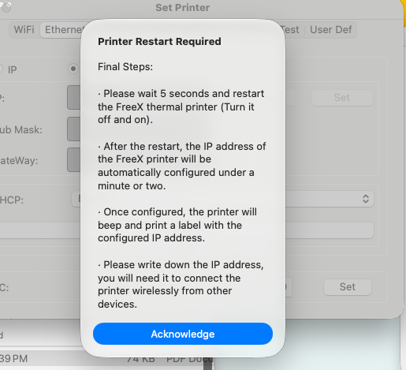
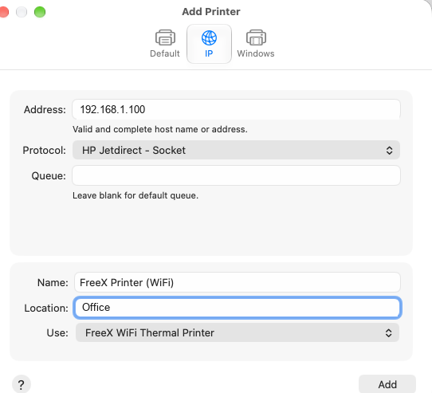

# Wi-Fi Setup for Thermal Label Printers on macOS

How to put a thermal label printer on your Wi-Fi network and add it to macOS as a network printer
over **TCP port 9100**.

The worked example is a **FreeX WiFi Thermal Label Printer** using the FreeX WiFi Toolbox. The macOS
side — port 9100, "HP Jetdirect – Socket", DHCP reservations, connectivity testing — is **identical
for any network thermal printer**. Only the vendor utility's screens differ. See
[other-printers.md](other-printers.md) for other brands.

> **⚠️ Install Rosetta 2 first if you are on an Apple Silicon Mac.** A Wi-Fi queue uses the same
> Intel-only CUPS filter as a USB queue, so it fails in exactly the same way until Rosetta is
> installed. Configuring Wi-Fi perfectly will not fix a filter problem. See the
> [README](../README.md).

All IP addresses and network names below are **placeholders**. Substitute your own.

---

## Before you start

- **The printer joins 2.4 GHz networks only.** The wireless module does not support 5 GHz or 6 GHz. If your router
  broadcasts one merged name across bands, this is the most common reason setup fails. Either
  temporarily split the bands, or use a router feature that lets a device bind to 2.4 GHz.
- **Connect the printer by USB first.** The FreeX WiFi Toolbox configures the printer's wireless
  settings *through the USB connection*. You cannot configure Wi-Fi over Wi-Fi from scratch.
- Get USB printing working first. It isolates the problem: if USB works and Wi-Fi does not, the
  issue is genuinely networking.
- Have your Wi-Fi password to hand. WPA2 personal (PSK) is what these printers expect.

---

## Step 1 — Configure Wi-Fi in the FreeX Toolbox

Connect the printer over USB, power it on, and open **FreeX WiFi Toolbox**.

Go to **FreeX Setup → WiFi** and enter:

| Field | Value |
| --- | --- |
| Mode | `STA` |
| Authentication | `WPA-PSK/WPA2-PSK` |
| Type | `WPA2-PSK` |
| Encryption | `AES` |
| SSID | `YOUR_WIFI_NAME` |
| Password | your Wi-Fi password |

Then **Apply** / **Set**.

**Notes**

- `STA` means *station* — the printer joins your existing network as a client. The alternative
  (`AP`, access point) makes the printer broadcast its own network, which is not what you want here.
- Type the SSID exactly, including capitalisation and spaces.
- Some SSIDs and passwords with unusual characters confuse this firmware. If the printer refuses to
  join and everything else looks right, try a network name without spaces or punctuation as a test.

---

## Step 2 — Configure the network settings

Go to **FreeX Setup → Ethernet**. Despite the name, on a Wi-Fi model this page configures the
printer's **IP settings** — it is not about a wired Ethernet port, and the FreeX WiFi model does not
have one:

| Field | Value |
| --- | --- |
| DHCP | `Enable` |
| Port | `9100` |

**Apply** the configuration.

**Port 9100** is the standard raw-TCP printing port (sometimes called JetDirect or AppSocket). macOS
talks to the printer directly on this port — no print server, no IPP, no drivers on the network side.

Leave **DHCP enabled**. If you want the printer to keep the same address, do it with a **DHCP
reservation on your router** rather than a static IP on the printer — it is more reliable and far
easier to undo.

---

## Step 3 — Restart the printer

Power the printer off and on.



On startup it should print a small **configuration label** showing:

- its assigned **IP address**
- the **SSID** it joined
- the **port** (`9100`)

Write down the IP. If no label prints, or the label shows no IP, the printer did not join the
network — see [Wi-Fi troubleshooting](#wi-fi-troubleshooting) below.

You can now unplug USB if you want, though leaving it connected does no harm.

---

## How to find your printer's IP address

You need this to add the printer over Wi-Fi. Three ways, easiest first.

### 1. Restart the printer and read the label it prints

**This is the simplest method and needs no technical knowledge.**

1. Switch the printer **off** with its power switch
2. Wait about 5 seconds
3. Switch it back **on**
4. Wait 1–2 minutes

Once it connects to Wi-Fi the printer beeps and prints a small **configuration
label** by itself. It looks roughly like this:

```
[WIFI Configure]
IP........192.168.1.100
SSID......YOUR_WIFI_NAME
Port......9100
```

The number next to **IP** is what you type into macOS. Write it down, or keep
the label.

> Nothing printed? Then the printer hasn't joined your Wi-Fi yet — go back to
> [Step 1](#step-1--configure-wi-fi-in-the-freex-toolbox). Also check labels are
> loaded and the cover is fully closed; a printer that can't print can't tell
> you its address.

### 2. Ask the FreeX Toolbox

Connect the printer by **USB**, open the **FreeX WiFi Toolbox**, then
**FreeX Setup → Ethernet**. The IP is shown there.

### 3. Look in your router's app

Open your router's phone app or admin page and find the list of connected
devices. The printer usually appears with a name like `FreeX`, `RT-Label`, or an
unfamiliar device on Wi-Fi. Its IP address is listed beside it.

If several devices look similar, match the **MAC address** shown in the Toolbox
against the one in your router.

### Already added the printer on a Mac?

If it worked before and you just need the address again, open Terminal and run:

```bash
lpstat -v
```

Look for the line naming your FreeX printer — the address is in it, like
`socket://192.168.1.100:9100`.

---

## Stop the IP address from changing

**This is the single most common reason a Wi-Fi label printer "randomly stops
working" weeks after a successful setup.** Worth ten minutes now.

### Why it happens

Your router hands out addresses on a lease (DHCP). The printer gets, say,
`192.168.1.100`, and macOS stores **that exact address** in the print queue.

Then the lease expires, or the router restarts, or the printer is off for a few
days — and the router gives it a different address. macOS is still pointing at
the old one, so jobs sit in the queue or fail. Nothing is broken; the Mac is
knocking on the wrong door.

### How to recognise it

- Printing worked fine, then stopped with no change on your part
- The printer is powered on, connected, and its status light looks normal
- `nc -vz OLD_IP 9100` now fails, where it used to succeed
- Restarting the printer makes it print a config label with a **different** IP
  than the one in your printer queue

If USB still prints but Wi-Fi doesn't, this is almost certainly the cause.

### The fix: reserve the address

A **DHCP reservation** tells the router "always give this device the same
address." The printer keeps using DHCP, so nothing changes on the printer side —
the router just always answers with the same number.

**Do this before reserving:** make sure the printer currently **has** a working
IPv4 address (something like `192.168.1.100`). If it doesn't, some routers will
try to reserve its IPv6 link-local address instead — a long value starting
`fe80:` — which does nothing useful. Restart the printer, confirm it prints a
config label showing an IPv4 address, and only then create the reservation.

#### The steps are the same on every router

Whatever router or mesh system you have, you are doing three things:

1. **Find the printer** in the router's list of connected devices
2. **Tell the router to always give it the same address** — a reservation
3. **Save**

Only the menu names differ. Look for whichever of these your router calls it:

> **DHCP Reservation** · **Address Reservation** · **Reserve IP** ·
> **Static Lease** · **Static DHCP** · **Bind IP to MAC** · **Fixed Address** ·
> **Manual Assignment**

It usually lives under **LAN**, **DHCP**, **Network Settings**, or on the
device's own detail page in a mesh app.

#### Worked example: eero

This is the system this guide was written on, so the steps are exact here. Other
mesh systems (Google Nest Wifi, Orbi, Deco, Velop, Amplifi) follow the same shape
with different wording.

1. Open the **eero** app
2. Tap **Devices** and find the printer — look for `FreeX`, `RT-Label`, or an
   unfamiliar device. If several look alike, match the **MAC address** shown in
   the FreeX Toolbox
3. Tap the device, then **Reservations & port forwarding**
4. Tap **Add a reservation**
5. Check the address offered is **IPv4** (`192.168.x.x`), not `fe80:...`
6. Save

#### Can't find a reservation feature at all?

Some ISP-supplied routers hide or omit it. Two fallbacks:

- **Extend the DHCP lease time** (often under LAN/DHCP settings) to a week or
  more, so the address changes far less often
- Set a **static IP on the printer** instead — see the warning below, and pick an
  address well outside the range your router hands out automatically

### Don't set a static IP on the printer instead

The Toolbox lets you switch **FreeX Setup → Ethernet** from DHCP to a fixed IP.
Avoid it unless you know your network well: if you pick an address the router
later hands to something else, you get an address conflict where both devices
misbehave intermittently — much harder to diagnose than the original problem.

A router-side reservation achieves the same result safely, and is easy to undo.

### If the address already changed

1. Restart the printer and read the IP from the label it prints
2. Remove the Wi-Fi printer in **System Settings → Printers & Scanners**
3. Add it again with the new address ([Step 5](#step-5--add-the-printer-in-macos))
4. Then create the reservation so it doesn't recur

---

## Step 4 — Test connectivity from the Mac

Replace `192.168.1.100` with the IP from the configuration label:

```bash
nc -vz 192.168.1.100 9100
```

Success looks like:

```
Connection to 192.168.1.100 port 9100 [tcp/hp-pdl-datastr] succeeded!
```

If that fails:

```bash
ping -c 3 192.168.1.100
```

- **Ping fails too** → the printer is not on the network, or your Mac is on a different network
  (guest Wi-Fi, a different VLAN, or a VPN that captures all traffic). Disconnect any VPN and retry.
- **Ping works but port 9100 refuses** → the printer is on the network but not listening. Re-check
  the port setting in the Toolbox and restart the printer.

---

## Step 5 — Add the printer in macOS

1. System Settings → **Printers & Scanners** → **Add Printer, Scanner, or Fax…**
2. Select the **IP** tab.

| Field | Value |
| --- | --- |
| Address | `192.168.1.100` (your printer's IP) |
| Protocol | **HP Jetdirect – Socket** |
| Queue | *leave blank* |
| Name | `FreeX Printer (WiFi)` |
| Location | optional |
| Use | **Select Software…** → **FreeX WiFi Thermal Printer** |

3. Click **Add**.



**Why "HP Jetdirect – Socket"?** It is just macOS's label for raw TCP printing on port 9100. It has
nothing to do with HP hardware and is the correct protocol for this printer. Do not use IPP, LPD, or
AirPrint.

**Do not** accept a generic driver. If the **Use** dropdown auto-fills with *Generic PostScript
Printer*, change it via **Select Software…** to **FreeX WiFi Thermal Printer**. A thermal label
printer does not understand PostScript.

---

## Step 6 — Print a test label

Open a 4x6 label PDF, press **⌘P**, choose the Wi-Fi queue, and set the paper size to the
4x6 / 100x150 mm entry. See the [4x6 Defaults](../README.md#4x6-label-defaults) section for saving this as
a preset so you don't set it every time.

---

## Wi-Fi troubleshooting

### No configuration label prints on restart

- The printer never joined the network. Re-check SSID, password, and that the network is 2.4 GHz.
- Confirm the Toolbox actually applied the settings — some versions need you to press **Set** on the
  WiFi page *and* **Apply** on the Ethernet page separately.
- Make sure labels are loaded and the gap sensor is calibrated; a printer that cannot detect labels
  prints nothing at all.

### The label prints but shows no IP address (or 0.0.0.0)

The printer associated with Wi-Fi but did not get a DHCP lease.

- Confirm DHCP is **Enable** in **FreeX Setup → Ethernet**.
- Check your router isn't out of DHCP addresses or filtering by MAC address.
- Restart the router, then the printer.

### It joined, but the Mac can't reach it

- Your Mac and the printer must be on the **same network**. Guest networks and client-isolation
  ("AP isolation") settings deliberately block device-to-device traffic — turn that off, or move the
  printer to the main network.
- Disconnect any VPN on the Mac and retry.
- Some mesh systems place devices on separate subnets. Check the IP range matches your Mac's:
  ```bash
  ipconfig getifaddr en0
  ```

### It worked, then stopped

Most likely the printer's DHCP lease expired and it got a new IP, while the macOS queue still points
at the old one. Restart the printer, read the IP from the new configuration label, and either update
the queue or — better — set a DHCP reservation on your router.

### Wi-Fi is configured but printing still fails with "Filter failed"

That is not a network problem. If `nc -vz YOUR_IP 9100` succeeds, the network is fine and the
failure is in the CUPS filter on your Mac. See the [README](../README.md) and
[troubleshooting.md](troubleshooting.md) — you need Rosetta 2.

---

## A note on macOS 28 and later

Network setup is unaffected by Apple's Rosetta 2 retirement — port 9100 keeps working. What stops
working from macOS 28 is the **Intel-only driver** that converts your document into printer
commands.

If you rely on this printer, check before upgrading:

```bash
bash scripts/diagnose_freex_macos.sh
```

If it still reports an Intel-only filter, see
[other-printers.md](other-printers.md#if-there-is-no-working-driver-at-all) for alternatives —
including driving the printer directly over port 9100, which needs no vendor driver at all.

---

## Privacy note

When sharing configuration screenshots or logs for help, redact your **SSID**, your **Wi-Fi
password**, your **local IP addresses**, and the printer's **serial number**. Use placeholders like
`YOUR_WIFI_NAME` and `192.168.1.100` instead.
